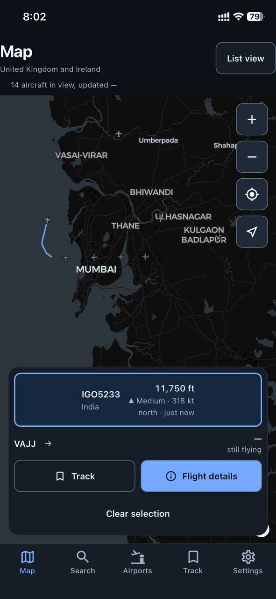
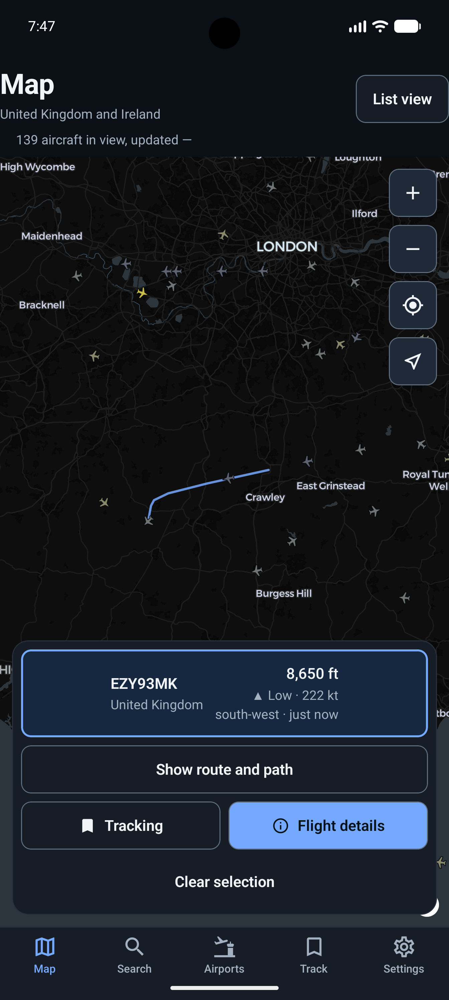
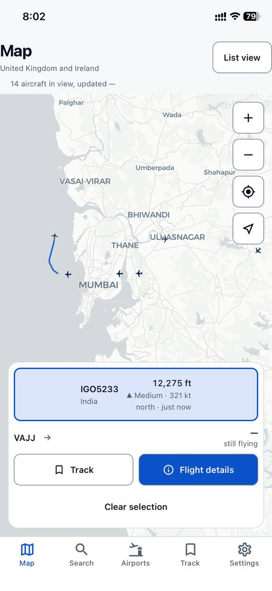
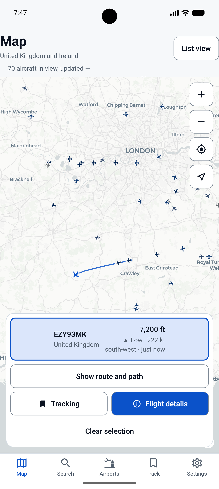
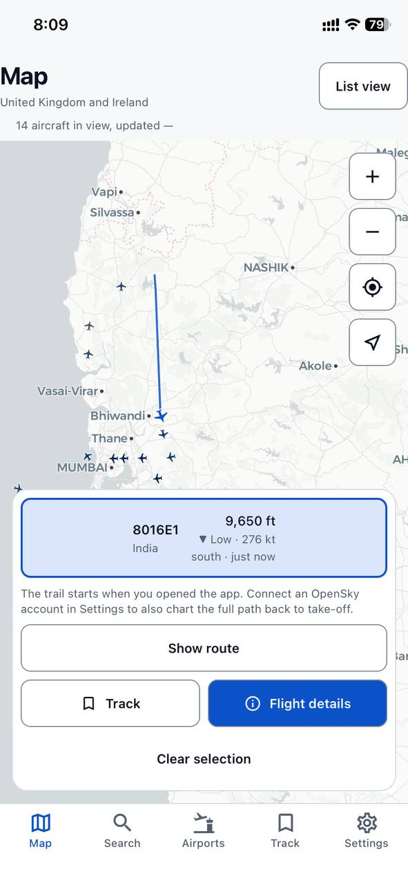
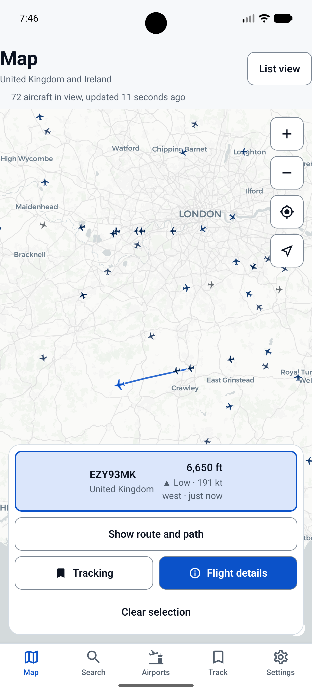

# where-flight — See What's Flying Overhead

> **A live flight tracker that treats the map as a picture, not as the interface.**

**where-flight** is a React Native mobile application that shows the aircraft
currently in the air over the UK and Ireland, using live position data from the
[OpenSky Network](https://opensky-network.org) — a free, public, community-run
API.

The name is the question the app answers: *where is that flight?* You can find
an aircraft on a map, search for it by callsign, read its full telemetry, keep
it to check on later, or look at what has been arriving and departing at a
given airport.

Two principles shaped the whole codebase. The first is that **the map is a
visualisation, not the interface** — a canvas full of moving dots is
meaningless to a screen reader, so every aircraft and every action is equally
reachable through ordinary accessible screens. The second is **honesty about
cost**: OpenSky's free tier is limited, and rather than hide that, the app
budgets it openly and prices every expensive request on the button before you
press it.

**Tagline:** *See what's flying overhead.*

---

## 1. Project Description

where-flight was developed for the **Mobile Applications (UFCF7H-15-3)**
practical assessment using **React Native, Expo and TypeScript**.

The application demonstrates the core mobile-development concepts required by
the brief:

* Multi-screen navigation (bottom tabs with nested stack screens)
* Zustand state management across independent stores
* Persistent local storage with AsyncStorage and the device keystore
* External API integration with a public, pre-made API
* Loading, error and empty states on every data screen
* Input validation and typed error handling
* A reusable themed component library
* Responsive layouts that reflow at large text sizes
* Light, dark and two high-contrast themes
* Accessibility as a first-class design constraint
* Automated testing (461 tests across 30 suites)
* User testing with real participants

A key design principle is **technical honesty**. The app never implies it knows
more than it does. An aircraft with no altitude reading says "unknown" rather
than showing zero; a trail assembled from positions observed since launch is
never presented as a departure point; and an API failure names its actual cause
rather than saying something generic went wrong.

---

# 2. Features

## 2.1 Map

The Map screen is the main entry point and shows live aircraft over the UK and
Ireland on a MapLibre vector map.

The screen provides:

* Aircraft rotated to their true heading and coloured by altitude band
* Tap-to-select, which recolours and enlarges the aircraft itself
* A trail behind the selected aircraft showing where it has been
* Native zoom, recentre and reset-north controls
* A **List view** toggle showing the same aircraft as an accessible list
* A live status line announcing how many aircraft are in view

Selection deliberately recolours the aircraft rather than drawing a ring around
it, and draws it larger at the same time, so the selected aircraft is still
identifiable without colour vision.

### Screenshot — Map Screen

> 
>
> 

**Figure 1. The Map screen showing live traffic with one aircraft selected and its trail drawn.**

---

## 2.2 Search

The Search screen is the accessible equivalent of the map, and a search box
over everything the app already knows.

The screen provides:

* Every aircraft in view as a list, one spoken sentence per row
* Pull-to-refresh
* A search box matching callsign, ICAO 24-bit address or origin country
* Airport matches from the bundled directory
* Honest loading, empty and error states

Searching costs no API credits and works offline, because everything it
searches is already on the device.

### Screenshot — Search Screen

> 
>
> 

**Figure 2. The Search screen listing live aircraft, with the freshness caption visible.**

---

## 2.3 Flight Detail

The Flight Detail screen shows everything known about one aircraft.

The screen displays:

* Altitude, vertical trend and altitude band
* Speed, vertical rate and heading with a compass bearing
* ICAO 24-bit address, callsign, squawk and position source
* How old the reading is, and the exact coordinates
* A **Track / Stop tracking** control
* With a connected account: the flight's route and altitude profile

### Screenshot — Flight Detail

> 
>
> 

**Figure 3. Flight Detail showing full telemetry for a selected aircraft.**

---

## 2.4 Track

The Track screen holds the flights you have chosen to keep, and is the clearest
demonstration of persistence in the app.

Each tracked flight stores its **entire last-known telemetry**, not just an
identifier, which is what allows the tab to work with no connection at all.
Every card shows how old its reading is, and carries a **Map** button that
opens the map centred on that flight.

### Screenshot — Track Screen

> 
>
> 

**Figure 4. The Track screen in aeroplane mode, showing tracked flights with "last seen" ages.**

---

## 2.5 Airports

The Airports screen shows arrival and departure boards for around 40 bundled
major airports.

The screen provides:

* A searchable airport picker (city, name, IATA or ICAO code)
* An arrivals / departures switch
* A board of flights with times and the other end of each route
* Cached boards, flagged when they go stale

These are the most expensive calls OpenSky offers, so **nothing loads
automatically**. The button states the credit cost before you press it, and a
fetched board is cached so opening it again is free.

### Screenshot — Airports Screen

> 
>
> 

**Figure 5. An airport arrivals board, with the credit cost shown on the load button.**

---

## 2.6 Settings

Settings holds every user preference, plus the API budget meter.

The screen provides:

* Theme: system, light or dark, plus a high-contrast switch
* Units: aviation, metric or imperial
* Reduced motion: system, on or off
* Whether to show aircraft on the ground
* Haptic feedback
* Connecting a personal OpenSky account
* A **budget meter** showing what today's API credits were spent on
* Clearing saved data

### Screenshot — Settings Screen

> 
>
> 

**Figure 6. Settings showing the units control and the API budget meter.**

---

### Screenshot — Dark and Light Themes

> 
>
> 
>
> 
>
> 

**Figure 7. The same screen in dark and light themes.**

---

# 3. Navigation Flow

where-flight uses **bottom-tab navigation with nested stack screens**,
implemented with expo-router's file-based routing.

### Screenshot — Bottom Navigation

> 
>
> 

**Figure 8. The bottom tab bar, showing all five tabs.**

### Navigation Structure

```
Root Stack  (src/app/_layout.tsx)
│
├── (tabs)                          bottom tab navigator
│   ├── index        → Map          live map + list view toggle
│   ├── search       → Search       aircraft list + search
│   ├── airports     → Airports     arrival / departure boards
│   ├── track        → Track        tracked flights, offline
│   └── settings     → Settings     preferences + budget meter
│
└── flight/[icao24]  → Flight Detail   pushed from any tab
```

Every tab can reach the Flight Detail screen, and the Track and Search tabs can
both drive the Map — tapping a tracked flight's Map button focuses the map on
that aircraft and clears the request once consumed, so returning to the map
later does not move the camera again.

Tab order is declared explicitly rather than left to the filesystem, because
expo-router falls back to alphabetical ordering for any route it is not given a
screen for.

---

# 4. Technologies Used

| Technology | Purpose |
| --- | --- |
| **React Native 0.81** | Cross-platform mobile framework |
| **Expo SDK 54** | Tooling, native modules and Expo Go distribution |
| **TypeScript 5.9** | Static typing across the whole codebase |
| **expo-router 6** | File-based navigation (tabs + stack) |
| **Zustand 5** | State management, one store per concern |
| **AsyncStorage** | Persistent local storage |
| **expo-secure-store** | Hardware-backed keystore for API credentials |
| **MapLibre GL JS** | Vector map, rendered inside a WebView |
| **react-native-webview** | Host for the map renderer |
| **react-native-svg** | Offline radar view and the altitude chart |
| **@shopify/flash-list** | Virtualised lists for large aircraft sets |
| **@react-native-community/netinfo** | Connectivity detection |
| **expo-haptics** | Non-visual feedback on selection and tracking |
| **Jest + jest-expo + RNTL** | Automated testing |
| **OpenSky Network REST API** | Live flight data (public, pre-made API) |

---

# 5. Application Architecture

```
src/
├── api/opensky/       OAuth2 token manager, HTTP client, response mappers,
│                      credit costs, typed error union
├── app/               expo-router routes
│   ├── (tabs)/        map · search · airports · track · settings
│   └── flight/        [icao24] detail screen
├── components/
│   └── ui/            themed kit: Button, Banner, Text, TextField, Pressable,
│                      Screen, Section, SegmentedControl, states
├── features/
│   ├── map/           WebView bridge, GeoJSON diffing, protocol, trail logic,
│                      offline radar, map controls, selection card
│   ├── flights/       list rows, polling controller, freshness rules,
│                      altitude ribbon, route line, track summary
│   └── settings/      account connection, budget meter
├── stores/            10 Zustand slices + 3 helpers (see section 6)
├── theme/             four palettes, WCAG contrast and CVD simulation
└── lib/               pure logic: geo maths, formatting, spoken descriptions,
                       airport directory, poll interval, haptics
```

The separation that matters is `lib/` and `api/` containing **no React at
all**. Everything in those folders is a plain function that can be tested
directly, which is why the majority of the test suite needs no rendering.

---

# 6. State Management

State is handled with **Zustand**, split into one store per concern rather than
a single global object. Each store owns its own persistence configuration.

| Store | Responsibility | Persisted |
| --- | --- | --- |
| `aircraft-store` | Live positions, load status, observed trails | Snapshot only |
| `followed-store` | Tracked flights with full telemetry | Yes |
| `map-store` | Camera, selection, list mode, focus requests | Camera + mode |
| `airports-store` | Cached arrival/departure boards | Yes |
| `track-store` | Fetched flight paths | In memory |
| `route-store` | Fetched routes (origin → destination) | In memory |
| `budget-store` | Daily API credit ledger | Yes |
| `credentials-store` | OpenSky account | Keystore only |
| `settings-store` | Theme, units, motion, haptics | Yes |
| `network-store` | Connectivity | No |

### Why Zustand rather than Context

Several of these stores update on a timer — aircraft positions change every few
seconds. With Context, every consumer of a provider re-renders when any part of
its value changes, so a ticking position store would re-render the whole tree.
Zustand's selector subscriptions mean a component that reads only
`state.status` does not re-render when a position moves.

---

# 7. Persistence

Persistence is what makes the app usable with no connection, and it is
deliberately layered.

| What | Where | Why there |
| --- | --- | --- |
| Tracked flights, with full telemetry | AsyncStorage | So the Track tab renders offline, not just a list of hex codes |
| Last aircraft snapshot | AsyncStorage (throttled) | So the first frame after launch is never empty |
| Airport boards | AsyncStorage | So re-opening a board costs no credits |
| Settings, map camera, credit ledger | AsyncStorage | Ordinary preferences and accounting |
| OpenSky client ID and secret | **expo-secure-store** | It is a credential, and belongs in the keystore |
| Observed trails, fetched paths and routes | Memory only | A trail restored from disk would describe a flight that has long since landed |

A **hydration gate** holds the splash screen until every persisted store has
been read back, so the app never flashes the wrong theme or an empty Track tab
for a frame before real data arrives.

### Screenshot — Persistence Evidence

> **[ SCREENSHOT STILL NEEDED — `docs/screenshots/ios/persistence-before.png` ]**
> **[ SCREENSHOT STILL NEEDED — `docs/screenshots/ios/persistence-after.png` ]**

**Figure 9. A tracked flight surviving a full app restart in aeroplane mode, with its "last seen" age.**

---

# 8. Installation and Run Instructions

## Prerequisites

* **Node.js 18 or newer**
* **npm**
* The **Expo Go** app on a physical device, or an Android emulator / iOS
  Simulator

No API key, account or configuration file is required. The app runs anonymously
by default.

## Clone the Repository

```bash
git clone https://github.com/raslaan-dev/where-flight.git
cd where-flight
```

## Install Dependencies

```bash
npm install
```

## Start the App

```bash
npx expo start
```

Then scan the QR code with Expo Go, or press `i` for the iOS Simulator and `a`
for an Android emulator.

A physical device is recommended. The map renders with WebGL inside a WebView,
and many emulators either lack WebGL or run it very slowly — the app detects
this and falls back to a native radar view, but a real device shows the map
itself.

## Run on a Specific Platform

```bash
npm run ios       # iOS Simulator (requires macOS and Xcode)
npm run android   # Android emulator or connected device
```

## Verification

```bash
npx tsc --noEmit    # TypeScript compiles with no errors
npm test            # 461 tests across 30 suites
npx expo-doctor     # Expo dependency and config health check
```

## A Note on the Expo SDK Version

This project is pinned to **Expo SDK 54** rather than the newest release, and
that is deliberate. Apple had not approved a newer build of the Expo Go app at
the time of development, so the App Store version is capped at SDK 54. Any
project targeting a later SDK cannot be opened on a physical iPhone without a
paid Apple Developer account or a custom development build. Nothing in this app
uses an SDK 55+ API, so pinning costs the project nothing and means it opens
for anyone with the free Expo Go app.

---

# 9. Error Handling and Validation

Every failure the API can produce is mapped to one of eight typed kinds, each
with plain-English copy and a route forward.

| Error kind | Shown as | Offers a retry? |
| --- | --- | --- |
| `OFFLINE` | No internet connection | No — nothing to retry against |
| `TIMEOUT` | The network timed out | Yes |
| `AUTH_INVALID` | Those OpenSky credentials were rejected | No — the same credentials fail again |
| `RATE_LIMITED` | OpenSky is rate limiting us | No — retrying makes it worse |
| `BUDGET_EXHAUSTED` | Today's API allowance is used up | No — no credits to spend |
| `SERVER` | OpenSky is having trouble | Yes |
| `BAD_REQUEST` | That area could not be searched | No — needs a different viewport |
| `BAD_PAYLOAD` | Unexpected response from OpenSky | Yes |

The copy table is a `Record` over the error union, so **adding a new error kind
without writing its copy is a compile error** rather than a blank screen.

Other handling worth noting:

* A failed refresh with data already on screen is a **banner**, not a takeover
  — the old positions are still the best answer available, and the banner says
  how old they are.
* Error boundaries sit at the root and specifically around the map, so a
  WebView crash costs the map and nothing else.
* OpenSky sometimes returns an HTML error page with a 200 status, so the client
  checks the content type rather than trusting the status code.
* A 404 from the airport endpoints means "nothing flew in that window", not a
  failure, and is handled as an empty board.

---

# 10. Accessibility

Accessibility shaped the architecture rather than being audited at the end.

* **A real non-visual equivalent to the map.** The WebView is hidden from
  assistive technology entirely; in its place sit a live status region, native
  controls, and a toggle to the same aircraft as a list. With a screen reader
  running, list view is the default.
* **Spoken descriptions are pure, tested functions.** Every aircraft and flight
  path has a real sentence describing it, so the information the chart shows is
  also said aloud.
* **A 48 dp touch-target floor**, enforced by the one shared Pressable
  component and asserted by a test.
* **Four palettes with proven contrast.** WCAG ratios are checked by a test
  against real numbers, and the altitude colour scale is verified against three
  colour-vision-deficiency simulations.
* **Genuine dynamic-type support.** At 130% scale and above the tab bar drops
  to icons only and telemetry rows stack, rather than clipping.

---

# 11. The API Credit Budget

OpenSky's free tier gives 400 credits a day anonymously, or 4,000 with a free
account. The app treats that as a budget to be spent visibly.

| Request | Cost | Policy |
| --- | --- | --- |
| `/states/all` (viewport) | 1–4 by area | Polled automatically, adaptive interval |
| `/tracks/all` (flight path) | 4 | On request; needs a connected account |
| `/flights/aircraft` (route) | 8 for a 12-hour window | On request |
| `/flights/arrival` / `/departure` (board) | 20 for a 24-hour window | On request, price shown |

Spend is tracked in a persisted ledger keyed to the **UTC** day, because that is
when OpenSky's allowance resets, and reconciled against the server's own
rate-limit header when it sends one. Roughly 10% of the daily allowance is held
in reserve so that a deliberate tap still works after a day of polling.

The airport boards use a day-long window rather than a cheaper two-hour one.
That is not carelessness — OpenSky derives arrivals from flights that have
already landed *and been processed*, which lags real time by hours. Testing the
live API directly, a two-hour arrivals window at Heathrow, Frankfurt and
Schiphol returned nothing every time, while departures over the identical
window returned rows.

---

# 12. Key Design Decisions

## Why the map is not the interface

A WebGL canvas cannot be made accessible by labelling it. Rather than ship an
inaccessible primary interface with a degraded fallback, the app renders the
same store two ways and treats both as first-class. This is why the Search tab
exists as a full screen rather than a hidden accessibility mode.

## Why credentials are user-supplied

Shipping a shared API secret inside the app is not possible to do safely.
Anything in the bundle — source, `app.config`, an `EXPO_PUBLIC_*` variable —
ships to the user's device, and a bundle is a file anyone can unzip. A `.env`
file protects the *repository*, not the *installed app*. The correct production
answer is a server-side token broker; for a device-only coursework app, letting
users supply and keep their own credentials in the keystore is the honest
ceiling. Anonymous mode stays the default so no account is ever required.

## Why trails have two sources, kept separate

A trail can come from OpenSky's `/tracks` endpoint, which reaches back to the
runway, or from positions the app has watched since launch. Only the first can
honestly be called a departure point, so the origin marker is drawn **only**
for a fetched track, and the card always says which one is on screen.

---

# 13. User Testing

where-flight was tested with real participants on both platforms. The full
protocol, session records, analysis and reflection are in
[`USER_TESTING.md`](USER_TESTING.md).

Summary of the approach:

* Task-based scenarios covering all five tabs and the offline path
* Think-aloud protocol, with observation notes taken live
* A post-task interview and a satisfaction survey
* Sessions on both a physical iPhone and an Android emulator

---

# 14. Known Issues and Limitations

### Crowdsourced coverage

OpenSky's data comes from volunteer receivers, so coverage is genuinely sparse
over oceans, much of Africa and large parts of Asia. An empty result in those
regions is correct rather than a fault, and the empty-state copy says so.

### The map needs a network on first load

MapLibre and the basemap tiles load from a CDN the first time the map is
opened. Aircraft data has a full offline story; the map's visuals do not. With
no connection at all the app falls back to the radar view.

### Flight paths require an account

The `/tracks` endpoint is authenticated-only on OpenSky's side. The app explains
this in place rather than failing silently. Routes and everything else work
anonymously.

### Airport data lags real time

Arrivals only appear once a flight has landed and been processed, so a board can
legitimately look quiet when the airport is not.

### A limited airport directory

The bundled directory covers around 40 major airports with friendly names.
Boards for other ICAO codes still work; they show the raw code instead of a
city.

### Emulator WebGL

Android emulators frequently cannot provide WebGL, so the map falls back to the
radar view there. This is an emulator limitation, not an app defect, but it does
mean emulator screenshots can differ from device screenshots.

---

# 15. Future Improvements

* A server-side token broker, so no user ever handles an API credential
* A larger, properly geocoded airport directory rather than a bundled list
* A user-selectable home region instead of a fixed UK and Ireland default
* Longer history in the budget meter than the current day
* Aircraft type and operator information, if a suitable free source exists
* Offline basemap tiles, so the map works from a cold start with no network

---

# 16. Assessment Evidence

| Area | Evidence in where-flight |
| --- | --- |
| **UI/UX and accessibility** | Four palettes with tested contrast, CVD-verified altitude scale, 48 dp touch targets, dynamic type reflow, screen-reader-first map alternative |
| **Navigation** | Five-tab bottom navigation with nested stack detail screens, cross-tab focus requests |
| **State management** | Ten Zustand stores, one per concern, with selector subscriptions |
| **Persistence** | AsyncStorage for data, expo-secure-store for credentials, hydration gate, full offline Track tab |
| **Functionality** | Live map, search, flight detail, routes, flight paths, airport boards, budget meter |
| **Code quality** | TypeScript throughout, no React in `lib/` or `api/`, exhaustive typed error union |
| **Testing and debugging** | 461 tests across 30 suites, typed error handling, error boundaries |
| **Documentation** | README and `USER_TESTING.md` |

---


# 18. Screenshot Checklist

Before submitting, replace every screenshot placeholder above with a real
screenshot from the final application. **Capture each on both platforms** —
Screenshots live in `docs/screenshots/android/` (and `ios/` if you add them).

* [ ] **Figure 1:** Map screen with an aircraft selected and its trail
* [ ] **Figure 2:** Search screen listing live aircraft
* [ ] **Figure 3:** Flight Detail with full telemetry
* [ ] **Figure 4:** Track screen in aeroplane mode
* [ ] **Figure 5:** Airport board with the credit cost visible
* [ ] **Figure 6:** Settings with the budget meter
* [ ] **Figure 7:** Dark and light themes
* [ ] **Figure 8:** Bottom tab navigation
* [ ] **Figure 9:** Persistence evidence, before and after restart

Screenshots showing **completed results** are stronger evidence than empty
input screens. For Figure 9 in particular, the "last seen" age is the part that
proves persistence, so make sure it is legible.

---

# 19. Attribution and Licence

* Flight data © [The OpenSky Network](https://opensky-network.org), used under
  its [terms](https://opensky-network.org/about/terms-of-use) for
  non-commercial research and education.
* Basemap © [OpenStreetMap](https://www.openstreetmap.org/copyright)
  contributors, © [CARTO](https://carto.com/attributions). Attribution is kept
  visible on the map itself.

---

# 20. Project Information

**Application:** where-flight — See What's Flying Overhead
**Module:** Mobile Applications (UFCF7H-15-3)
**Framework:** React Native / Expo SDK 54
**Language:** TypeScript
**Student:** Mohamed Raslaan Najeeb
**Repository:** https://github.com/raslaan-dev/where-flight

Coursework project — not for commercial use.
