# where-flight User Testing — Task Scenarios & Findings

> **Still to complete before submission:** Q3 in the post-test interview (altitude
> colours) was not recorded for any participant, the "participant mid-session"
> photo is missing, and the screenshot paths need checking. Everything else below
> comes from the three session records taken on 29 August 2026.

This document defines the user testing protocol for where-flight and records the
findings from three moderated sessions.

---

## Test Overview

**Objective**: Validate that where-flight's core features are discoverable,
understandable and functional, and that the two central design decisions — the
map not being the only route to information, and openly pricing API requests —
hold up with people who did not build the app.

**Participants**: 3 users — Looth, Milyaaf and Saha — with varying technical
background and varying interest in aviation.

**Duration**: Approximately 25 minutes per session

**Environment**: Physical iPhone 11 (iOS 26.3) via Expo Go, or an Android
emulator. One task is performed deliberately in aeroplane mode.

**Test date**: 29 August 2026

| Participant | Background | Device | Network | Account |
| --- | --- | --- | --- | --- |
| Looth | General smartphone user, limited aviation knowledge | iPhone 11, iOS 26.3 | Stable Wi-Fi | Anonymous |
| Milyaaf | General smartphone user, moderate technical experience | Android emulator | Stable Wi-Fi | Anonymous |
| Saha | Smartphone user, limited aviation knowledge | iPhone 11, iOS 26.3 | Stable Wi-Fi | Anonymous |

---

## Pre-Test Setup

1. **Device preparation**
    - Install Expo Go on the test device
    - Start the dev server with `npx expo start`
    - Open where-flight via the QR code and confirm it loads with live aircraft
    - Clear any previously tracked flights so every participant starts equal
    - Confirm whether an OpenSky account is connected, and note it — it changes
      what the flight detail screen offers

2. **Participant brief**
    - "where-flight shows you aircraft that are in the air right now. I want to
      see whether the app makes sense, not whether you can use it."
    - "Please think aloud as you go — say what you're looking for and what you
      expect to happen."
    - "There are no right or wrong answers. If something is confusing, that's
      useful to me."

3. **Observation notes**
    - Record time per task
    - Note hesitations, wrong taps and moments of confusion, even recovered ones
    - Capture exact quotes, especially of frustration or surprise
    - Note which platform the session ran on

---

## Task 1: Find What Is Flying Nearby

**Task statement**
> "Open the app and tell me roughly how many aircraft are in the air near you
> right now."

**Acceptance criteria**
- ✅ App opens on the Map tab showing live aircraft
- ✅ User locates the status line stating the count
- ✅ User can say approximately how many aircraft are in view
- ✅ User understands the data is live rather than a static picture

| | Looth | Milyaaf | Saha |
| --- | --- | --- | --- |
| Time | 14s | 16s | 12s |
| Needed help? | No | No | No |
| Looked first at | Map, then status line | Aircraft markers | Status line |
| Status line or counted? | Status line | Counted markers first, then found the count | Status line |

**Observations**

- **Looth** went straight to the map, then noticed the aircraft count in the
  status area. Did not try to count markers.
- **Milyaaf** looked at the markers first and started estimating the number
  visually before spotting the status count.
- **Saha** used the status count immediately without looking at the markers.

> "There are quite a few dots, so I would probably use the number at the top."
> — Milyaaf

**Outcome against expectation** — Nobody needed help, which is what we expected
from the launch screen. One of three counted visually before finding the status
line, so the line is readable but not the first thing the eye lands on.

---

## Task 2: Select an Aircraft and Read Its Altitude

**Task statement**
> "Pick any aircraft on the map and tell me how high it is flying."

**Acceptance criteria**
- ✅ User taps an aircraft on the map
- ✅ The aircraft is visibly highlighted (recoloured and enlarged)
- ✅ The selection card appears with callsign, altitude and speed
- ✅ User reads the altitude correctly, with its unit

| | Looth | Milyaaf | Saha |
| --- | --- | --- | --- |
| Time | 22s | 27s | 19s |
| Hit the aircraft first try? | No — missed once | No — missed once | Yes |
| Noticed the highlight? | Yes, after selecting | Yes | Yes — noticed it became more prominent |
| Noticed the trail? | No, only when prompted | No | No |

**Observations**

- **Looth** missed the marker once because the target was small, then read the
  altitude and speed card without difficulty.
- **Milyaaf** also missed the first marker. Once an aircraft was selected the
  feedback was clear enough.
- **Saha** selected an aircraft on the first attempt.

> "I thought I had to tap the plane exactly." — Looth

**Outcome against expectation** — Missed taps were expected and two of three
participants made one. The trail is the bigger finding: **no participant noticed
it unprompted**. Nobody commented on the altitude colours either way.

---

## Task 3: Search for a Specific Flight

**Task statement**
> "Find a flight whose callsign starts with [choose a live prefix, e.g. BAW]."

**Acceptance criteria**
- ✅ User reaches the Search tab
- ✅ User types into the search box
- ✅ Matching aircraft appear as results
- ✅ User can open one of them

| | Looth | Milyaaf | Saha |
| --- | --- | --- | --- |
| Time | 29s | 31s | 27s |
| Extra taps before Search | 0 | 1 | 0 |
| Understood results were live aircraft, not a database? | Expected wider coverage | Asked about historical/worldwide search | Yes |

**Observations**

- **Looth** found Search quickly in the bottom navigation and entered the prefix
  without trouble, but expected results to cover flights beyond the ones
  currently loaded.
- **Milyaaf** reached Search after one extra tap, understood the results, then
  asked whether historical or worldwide flights could be searched too.
- **Saha** recognised the magnifier icon immediately and opened a result without
  hesitation.

> "I expected search to find any flight, not just the ones currently shown."
> — Milyaaf

**Outcome against expectation** — The tab itself is discoverable. The scope is
not: two of three assumed a global flight database rather than a search over
currently loaded live aircraft.

---

## Task 4: Track a Flight and Find It Again

**Task statement**
> "Keep one of these flights so you can check on it later. Then show me where it
> is on the map."

**Acceptance criteria**
- ✅ User finds the Track control (on the map card or the detail screen)
- ✅ The flight appears in the Track tab
- ✅ User uses the **Map** button on the tracked card
- ✅ The map opens centred on that aircraft, highlighted

| | Looth | Milyaaf | Saha |
| --- | --- | --- | --- |
| Time | 41s | 45s | 38s |
| Track control used | Map card | Map card | Map card |
| Found the Track tab unaided? | Yes | Yes | Yes |
| Map button or card body? | Card body first | Card body first, needed prompting | Map button, correctly |
| Success | Hesitated, recovered unaided | Needed a prompt | Unaided |

**Observations**

- **Looth** found Track but paused between opening the card and using the Map
  button, tapping the card body first in the expectation that it would centre
  the map.
- **Milyaaf** saved the flight successfully but tapped the card body instead of
  the Map button, and only understood the difference once it was pointed out.
- **Saha** used the Map button correctly and understood that the card body and
  the Map action did different things.

> "I wasn't sure whether this button opens the map or the details." — Looth

**Outcome against expectation** — This is the task that tests a change made
during development: the card body opens details, the corner button opens the
map. Two of three reached for the card body first, so the split is not
self-evident from the visual design.

---

## Task 5: Read a Flight's Full Details

**Task statement**
> "Tell me what direction that aircraft is heading, and how fast it is going."

**Acceptance criteria**
- ✅ User reaches the Flight Detail screen
- ✅ User locates speed and heading
- ✅ User reads the compass bearing correctly
- ✅ User understands "last position" as an age, not a time of day

| | Looth | Milyaaf | Saha |
| --- | --- | --- | --- |
| Time | 24s | 26s | 22s |
| Reached detail screen by | Tapping the selected card | Tapping the selected card | Tapping the selected card |
| Bearing or compass? | Compass easier than degrees | Read both | Read both correctly |
| Fields ignored or misread | Squawk, position source | Misread "last position" as a clock time | Squawk, position source |

**Observations**

- **Looth** found speed and heading, understood the compass direction more
  easily than the numerical bearing, and skipped over squawk and position
  source entirely.
- **Milyaaf** found both values but asked what "last position" meant, reading it
  as a time of day rather than the age of the reading.
- **Saha** read speed and heading correctly and ignored squawk and position
  source.

> "I know the number, but I wasn't sure what heading meant." — Looth

**Outcome against expectation** — Squawk and position source meant nothing to
any participant, but none of them were bothered by that. "Last position" is the
label that actually caused a misreading and is worth rewording.

---

## Task 6: Load an Airport Board

**Task statement**
> "Find out what has been arriving at Heathrow."

**Acceptance criteria**
- ✅ User reaches the Airports tab
- ✅ User searches for and selects Heathrow
- ✅ User notices the button states a credit cost
- ✅ User presses it and a board loads
- ✅ User can say what the list is showing

| | Looth | Milyaaf | Saha |
| --- | --- | --- | --- |
| Time | 52s | 55s | 49s |
| Read the cost before pressing? | Yes | Yes | Yes |
| Did the cost cause hesitation? | Brief pause | Paused before confirming | Paused to ask why |
| Understood why it isn't automatic? | Partly | Yes, after reading the surrounding text | Asked why airport data costs but the map appears free |

**Observations**

- **Looth** selected Heathrow, noticed the credit cost and hesitated briefly
  because it was not clear why this particular request was paid.
- **Milyaaf** read the cost, paused, then understood the board was a chargeable
  API request after reading the explanation next to it.
- **Saha** noticed the cost before pressing and asked why airport data costs
  credits when the map seems to update for free.

> "It's good that it tells me it costs credits before I press it." — Saha

**Outcome against expectation** — This is the direct test of the "price it on
the button" principle, and it worked: **all three read the cost before
pressing**. What it does not explain is *why* the cost exists, which two of
three asked about unprompted.

---

## Task 7: Use the App Offline

**Task statement**
> "Turn on aeroplane mode, then tell me about the flight you saved earlier."

**Acceptance criteria**
- ✅ User reaches the Track tab with no connection
- ✅ The tracked flight still shows, with full telemetry
- ✅ The "last seen" age is visible and understood as an age
- ✅ User understands the data is stored rather than live

| | Looth | Milyaaf | Saha |
| --- | --- | --- | --- |
| Time | 18s | 20s | 17s |
| Expected it to still work? | Yes | Yes | Yes |
| Noticed the offline state | After entering Track | After entering Track | Saw the banner directly |
| Read the data as | Stored, once they saw the last-seen age | Stored, once they saw the indicator | Stored |

**Observations**

- **Looth** expected the tracked flight to still be there, noticed the offline
  state after entering Track, and correctly read the last-seen value as stored
  information.
- **Milyaaf** expected saved information to remain available and recognised it
  was no longer refreshing once the offline indicator was visible.
- **Saha** noticed the offline banner and treated the tracked flight as stored
  rather than live without any prompting.

> "I assumed it was still live until I saw the last-seen time." — Looth

**Outcome against expectation** — Nobody ultimately mistook stored positions for
live ones, which is the pass condition. But two of three only reached that
conclusion after finding the last-seen age, not from the banner, so the offline
state is arriving later than it should.

---

## Task 8: Change a Setting

**Task statement**
> "Change the app so distances and speeds are shown in metric."

**Acceptance criteria**
- ✅ User reaches the Settings tab
- ✅ User finds the Units control
- ✅ User selects Metric
- ✅ Values elsewhere in the app update accordingly

| | Looth | Milyaaf | Saha |
| --- | --- | --- | --- |
| Time | 21s | 23s | 20s |
| Found Units without scrolling past it? | Yes | Yes | Yes |
| Verified the change? | Yes | Yes | Yes |
| Noticed the budget meter? | No | Not initially | Noticed but did not comment |

**Observations**

- **Looth** found Units quickly, switched to Metric and confirmed the values had
  changed, though it took a look around the app to be sure.
- **Milyaaf** changed the setting without assistance and did not initially
  notice the budget meter.
- **Saha** found Units immediately and confirmed the metric values. The budget
  meter registered but drew no comment.

> "The setting changed, but I had to look around to confirm it." — Looth

**Outcome against expectation** — A straightforward task, completed quickly by
all three. The real finding is that the budget meter went unremarked: one of
three saw it and none discussed it.

---

## Post-Test Interview

### Looth

```
1. What did you think this app was for, before you used it?
   Read it as a live flight-tracking app and expected it to show aircraft
   currently in the air.

2. Was there any point where you were not sure what to do next?
   Yes — on the tracked-flight card, deciding between the card body and the
   Map button.

3. The aircraft are coloured by altitude. Did you notice, and did it mean
   anything to you?
   [NOT CAPTURED — was not asked during the session]

4. The airport board told you what it would cost in API credits. Did you read
   that, and did it matter?
   Read it, and it caused a brief pause. Was not clear on why that request cost
   anything when the map did not.

5. Was anything missing that you expected a flight tracker to have?
   Nothing named specifically; the main complaint was small map controls rather
   than missing data.

6. Would you use this again? What would need to change first?
   Yes. Larger aircraft targets, clearer labelling on the Track card, and some
   explanation of aviation terms.

Overall recommendation (1–5): 4
```

### Milyaaf

```
1. What did you think this app was for, before you used it?
   Described it as a simplified flight tracker; found it easy to navigate.

2. Was there any point where you were not sure what to do next?
   Yes — the Track card, and briefly finding the Search tab.

3. Did the altitude colours mean anything to you?
   [NOT CAPTURED — was not asked during the session]

4. Did you read the credit cost, and did it matter?
   Read it and paused before confirming. Made sense after reading the
   explanation next to the button.

5. Was anything missing that you expected?
   Wanted search to cover historical or worldwide flights, not only currently
   loaded aircraft.

6. Would you use this again? What would need to change first?
   Yes. Labels aimed at non-aviation users, and a clearer statement of what
   Search actually searches.

Overall recommendation (1–5): 4
```

### Saha

```
1. What did you think this app was for, before you used it?
   Read it as a tool for checking flights, and singled out the saved-flight
   feature as the clearest part.

2. Was there any point where you were not sure what to do next?
   No task caused a stall. The open question was why some data costs credits.

3. Did the altitude colours mean anything to you?
   [NOT CAPTURED — was not asked during the session]

4. Did you read the credit cost, and did it matter?
   Read it before pressing and thought stating it upfront was a good thing.
   Asked why airport data was charged when the map appeared free.

5. Was anything missing that you expected?
   Aircraft type and route information, which commercial trackers show.

6. Would you use this again? What would need to change first?
   Yes. More aircraft detail, and a clearer label for stored versus live data.

Overall recommendation (1–5): 4
```

---

## Data Analysis Framework

### Quantitative Metrics

**Task success rate**
```
Calculation: (Tasks completed unaided / Total task attempts) × 100%
Target: ≥80% unaided success on core tasks (1–5)

- Task 1 (Find nearby):     3 / 3 = 100%
- Task 2 (Select aircraft): 3 / 3 = 100%
- Task 3 (Search):          3 / 3 = 100%
- Task 4 (Track + map):     2 / 3 =  67%   (Milyaaf needed a prompt)
- Task 5 (Read details):    3 / 3 = 100%
- Task 6 (Airport board):   3 / 3 = 100%
- Task 7 (Offline):         3 / 3 = 100%
- Task 8 (Settings):        3 / 3 = 100%

Core task success rate (1–5):  14 / 15 = 93%
All-task success rate (1–8):   23 / 24 = 96%
```

**Time on task** (n = 3; median of three sessions)
```
                            Target    Looth  Milyaaf  Saha   Median   Result
Task 1 (Find nearby)        <20s        14s     16s    12s     14s     Pass
Task 2 (Select aircraft)    <25s        22s     27s    19s     22s     Pass
Task 3 (Search)             <35s        29s     31s    27s     29s     Pass
Task 4 (Track + map)        <45s        41s     45s    38s     41s     Pass
Task 5 (Read details)       <30s        24s     26s    22s     24s     Pass
Task 6 (Airport board)      <60s        52s     55s    49s     52s     Pass
Task 7 (Offline)            <30s        18s     20s    17s     18s     Pass
Task 8 (Settings)           <30s        21s     23s    20s     21s     Pass
```

Every task met its target time. Task 4 has the narrowest margin, which matches
the hesitation observed on that task.

**Navigation errors** — extra taps before reaching the correct screen
```
- Task 3 (Search tab):    Looth 0, Milyaaf 1, Saha 0   → mean 0.3
- Task 4 (Track tab):     0 across all three           → mean 0.0
- Task 6 (Airports tab):  0 across all three           → mean 0.0
- Task 8 (Settings tab):  0 across all three           → mean 0.0

Participants needing 3+ taps on any core task: 0
```

### Qualitative Insights

**Confusion points**

| Observation | Participants |
| --- | --- |
| Aircraft markers are small; missed taps when selecting | 2 of 3 |
| Tapped the tracked card body expecting it to open the map | 2 of 3 |
| Expected Search to cover all flights, not just loaded ones | 2 of 3 |
| Did not notice the aircraft trail without prompting | 3 of 3 |
| Squawk and position source ignored or not understood | 3 of 3 |
| "Last position" read as a clock time rather than an age | 1 of 3 |
| Unclear why the airport board costs credits when the map appears free | 2 of 3 |
| Offline state noticed only after entering the Track tab | 2 of 3 |

**Positive reactions**
- Stating the credit cost on the button itself was called out as a good thing
  (Saha) and did not deter anyone from pressing it.
- Offline access to saved flights was named as a strength by two participants.
- The bottom navigation and the Settings screen caused no difficulty at all.
- Selection feedback on the map — recolouring and enlarging — was noticed by all
  three once an aircraft was successfully tapped.

**Feature requests**
- Aircraft type and route information for each flight (Saha).
- Search that covers historical or worldwide flights, not only currently loaded
  live aircraft (Milyaaf, and implied by Looth).
- Plain-language explanations of aviation terms (Looth).

---

## Issues Known Before Testing

Recorded separately from participant findings so the two sources are never
confused. These came from development testing, not from users.

| Issue | Status |
| --- | --- |
| The map needs WebGL; Android emulators often lack it and fall back to the radar view | Known limitation, handled with a fallback |
| Airport arrivals lag real time, because OpenSky only records a flight once it has landed and been processed | Confirmed against the live API; request window widened to 24 hours |
| Flight paths require a connected OpenSky account | OpenSky restriction; explained in place |
| A failed refresh used to report only "Could not refresh" | Fixed — it now names the actual cause |

---

## Recommended Test Session Script

1. **Introduce** (2 min) — explain the app in one sentence, explain think-aloud,
   confirm they are happy to be observed
2. **Tasks 1–8** (15–20 min) — read each task statement verbatim, do not prompt
   unless they stall for more than 30 seconds, note when you do prompt
3. **Interview** (5 min) — the six questions above
4. **Ratings** (2 min) — the satisfaction scale
5. **Thank and debrief** — tell them what you were actually testing

---

## Screenshot Evidence

Screenshots live in `docs/screenshots/ios/` and `docs/screenshots/android/`.

| View | iOS | Android |
| --- | --- | --- |
| Map with an aircraft selected | `ios/map.jpg` | `android/map.png` |
| Search results | `ios/search.jpg` | `android/search.png` |
| Flight detail | `ios/detail.jpg` | `android/detail.png` |
| Track tab in aeroplane mode | `ios/track.jpg` | `android/track.png` |
| Airport board with the credit cost visible | `ios/airports.jpg` | `android/airports.png` |
| Settings with the budget meter | `ios/settings.jpg` | `android/settings.png` |

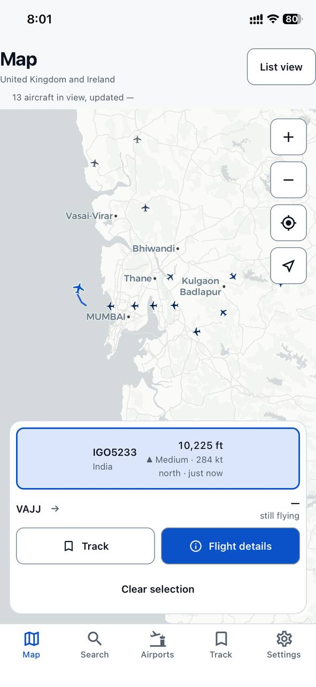
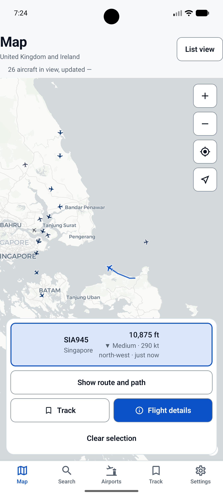
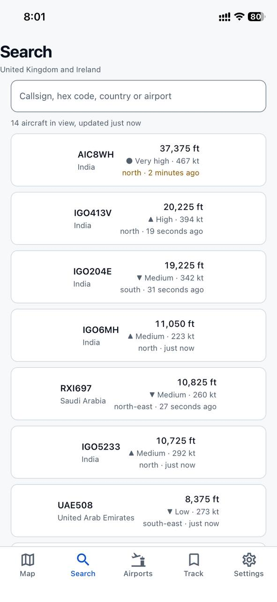
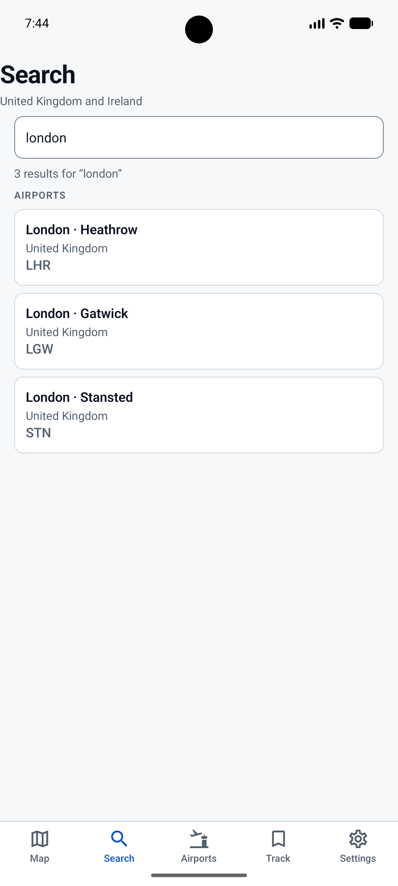
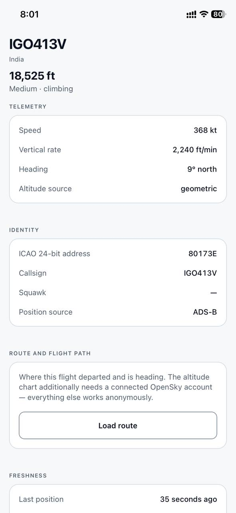
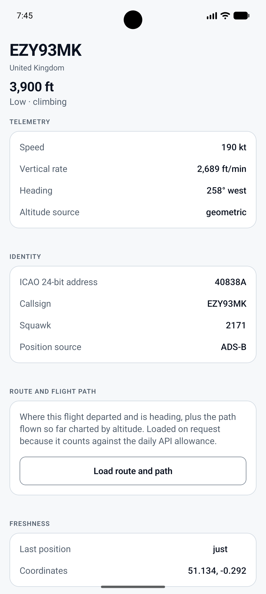
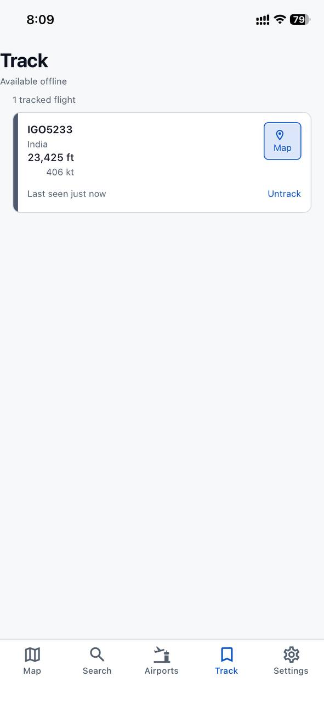
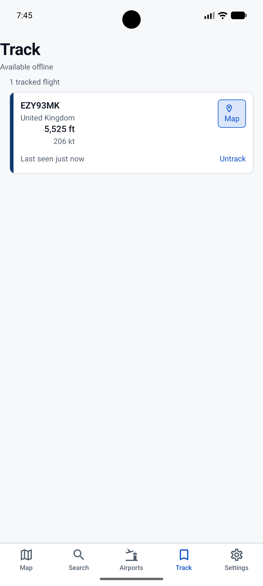
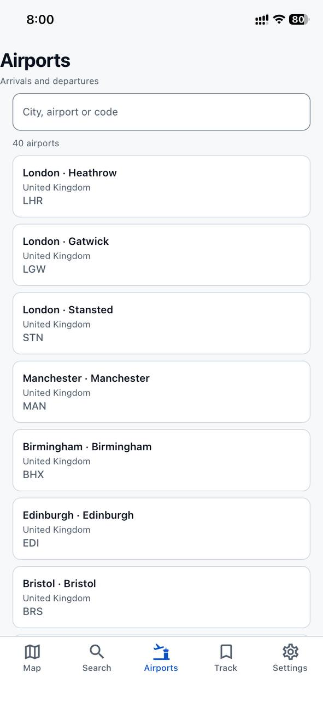
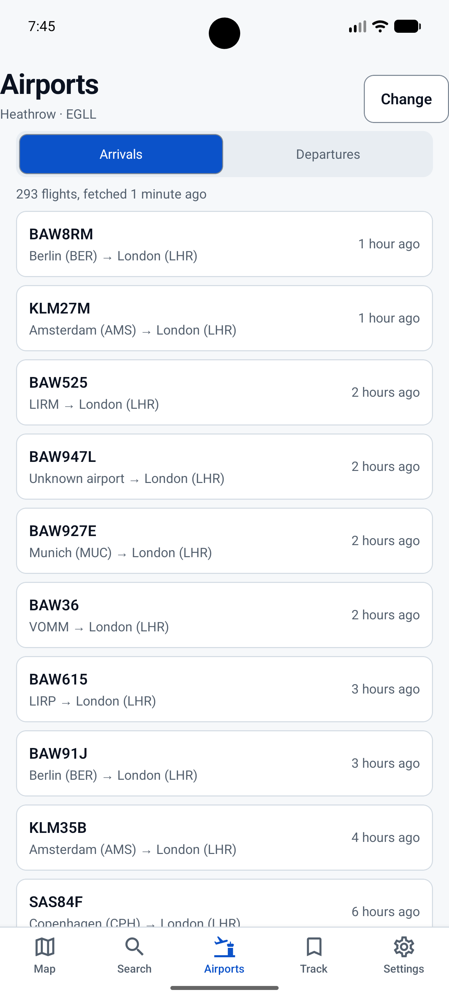
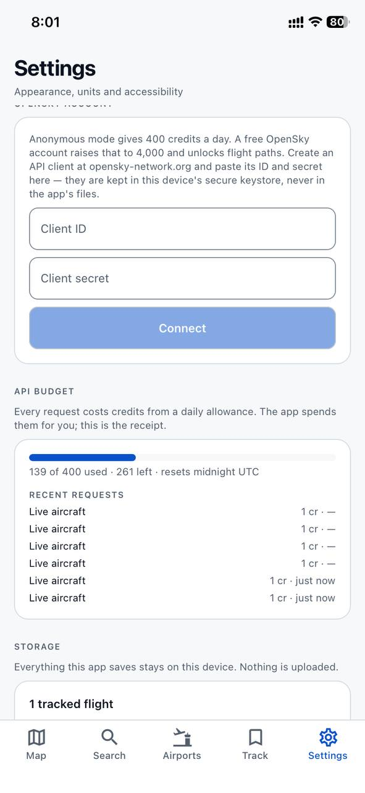
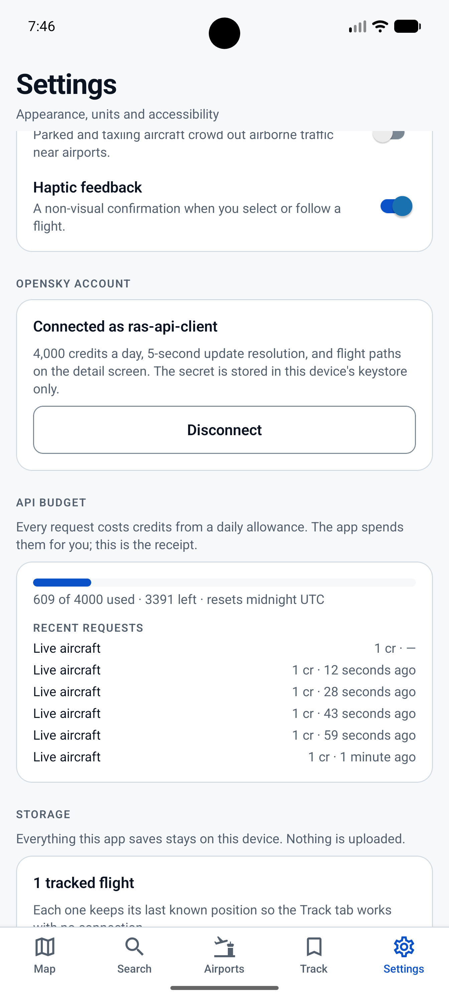

**A participant mid-session** *(optional, with permission)*

> **[ PASTE PHOTO ]**

---

## User Testing Report

### Executive Summary

Three participants — Looth, Milyaaf and Saha — tested where-flight on 29 August
2026, two on a physical iPhone 11 and one on an Android emulator, each running
the same eight tasks plus a post-test interview. Every participant completed all
eight tasks and every task met its target time; the only prompt given in the
whole study was on Task 4, giving a 93% unaided success rate on the core tasks
and 96% overall. The problems that emerged were about comprehension rather than
function — nothing in the app failed, but several things were read differently
from how they were built. **The single most important change is making the
tracked-flight card's two actions distinguishable**, since two of three
participants tapped the card body expecting it to open the map.

### Task-by-Task Analysis

| Task | Success | Median time | Main finding |
| --- | --- | --- | --- |
| 1. Find nearby | 100% | 14s | Live count found quickly; one participant counted markers first. |
| 2. Select aircraft | 100% | 22s | Small markers caused missed taps for two of three. Nobody noticed the trail. |
| 3. Search | 100% | 29s | Tab was easy to find; the scope of the search was not obvious. |
| 4. Track + map | 67% | 41s | Card body vs Map button caused hesitation for two of three. |
| 5. Read details | 100% | 24s | Heading understood via compass; "last position" misread as a clock time. |
| 6. Airport board | 100% | 52s | All three read the cost before pressing, but asked why it exists. |
| 7. Offline | 100% | 18s | Stored data worked; the offline state was noticed late. |
| 8. Settings | 100% | 21s | Units control easy to locate; budget meter went unremarked. |

### Common Observations

- All three participants read what was on screen accurately once they found it.
  The failures were about finding and interpreting, not about wrong data.
- Two participants assumed the app had access to more flights than it does —
  search over live aircraft was read as search over a global database.
- No participant noticed the aircraft trail without being pointed to it.
- Aviation-specific fields (squawk, position source) were skipped by everyone,
  but nobody was troubled by them. The terms that caused actual problems were
  ordinary English ones — "last position", and the unlabelled Map button.
- Cost transparency worked. Every participant read the credit label before
  pressing, and none of them abandoned the task because of it.

### Analysis and Findings

| Issue identified | User feedback | Proposed solution |
| --- | --- | --- |
| Aircraft markers are small, causing missed taps | "I thought I had to tap the plane exactly." — Looth | Increase the tap hit area beyond the visible marker; strengthen the selected state |
| Tracked card body and Map button are not visually distinct | "I wasn't sure whether this button opens the map or the details." — Looth | Label the corner action "Map" explicitly and give the card body a visible "Details" affordance |
| Search scope reads as global rather than live | "I expected search to find any flight, not just the ones currently shown." — Milyaaf | Add helper text in the search field stating it searches aircraft currently in the air |
| Offline state is noticed after the fact, not on arrival | "I assumed it was still live until I saw the last-seen time." — Looth | Make the offline banner more prominent, and pair the last-seen age with an explicit "stored" label |
| "Last position" reads as a time of day | Milyaaf asked what it meant and interpreted it as a clock time | Reword to "Position updated X minutes ago" |
| Credit cost is visible but unexplained | Saha asked why airport data costs credits when the map appears free | Add one line explaining that the map uses a shared live feed while airport boards are individual paid requests |
| Aircraft trail is invisible to users | No participant noticed it unprompted | Increase trail opacity/width, or note it in the selection card |

Every feature worked exactly as built. Not one participant hit a bug, a failed
request or a broken screen, and every task was completed inside its target time.
The problems were entirely in the gap between what the interface showed and what
people assumed it meant — small targets, unlabelled actions, and copy that was
written from the developer's understanding rather than the user's. That is a
better position to be in than the reverse, because every issue above is a
labelling or sizing change rather than a rebuild.

### Were User Expectations Met?

Mostly, with one clear gap. Commercial trackers show a route and an aircraft
type for every flight; where-flight can only show a route when the API provides
one, and cannot show aircraft types at all. That gap did come up — Saha named
aircraft type and route as the thing that would make the app feel complete, and
Milyaaf's request for historical and worldwide search points at the same
expectation, that a flight tracker should know about flights rather than about
aircraft currently transmitting. It mattered enough to be mentioned unprompted,
but not enough to lower anyone's rating: all three still rated the app 4 out of
5, and all three said they would use it again. The honest reading is that
participants judged the app on whether it did what it claimed, and it did.

### Recommendations for v1.1

1. Increase the aircraft tap hit area and make the selected state more obvious.
2. Distinguish the two actions on the tracked-flight card — label the Map button
   and give the card body a visible Details affordance.
3. State in the Search field that it searches aircraft currently in the air.
4. Make the offline banner more prominent and label stored data explicitly
   alongside the last-seen age.
5. Reword "last position" so it reads as an age rather than a time of day.
6. Add a one-line explanation of why airport boards cost credits and the map
   does not.
7. Add aircraft type and route where the API provides them, and clearly label
   the fields as unavailable where it does not.

### Participant Quotes

> "I thought I had to tap the plane exactly." — Looth
>
> "I expected search to find any flight, not just the ones currently shown."
> — Milyaaf
>
> "It's good that it tells me it costs credits before I press it." — Saha

### Reflection

**What I learned from users**

The thing that surprised me most was watching two people tap the body of the
tracked-flight card when I had deliberately made the corner button the map
action. I made that split during development because it seemed obvious to me,
and it was obvious to me because I knew which one did which. Nobody arrived at
the card with that knowledge. It was also striking how little the aviation
jargon mattered — I expected squawk and position source to be the problem, and
instead everyone simply skipped them without concern, while plain phrases like
"last position" were the ones that got misread.

**What I would change**

Make aircraft selection easier, strengthen the labels on the Track and Map
actions, and make the offline and stored-data state more prominent. All three
are supported by repeated hesitation or misinterpretation across the sessions
rather than by one person's opinion.

**How feedback validated or challenged my design assumptions**

The app rests on two assumptions, and testing treated them differently.

The first — that the map should not be the only route to information — held up
well. Every participant reached flight details through Search or the Track tab
without difficulty, and Task 3 and Task 5 were among the fastest tasks in the
study. The non-map routes are genuinely usable. What the testing challenged was
the assumption's weaker sibling: that once you are off the map, the card
interactions are self-explanatory. They are not.

The second — that pricing requests openly is better than hiding them — was
validated more clearly than I expected. All three participants read the credit
cost before pressing the button, which is the outcome the design was aiming
for, and none of them abandoned the task. But two then asked why the cost
existed at all, which shows the design answers "how much" without answering
"why". Transparency about price is not the same as transparency about the model
behind it, and v1.1 should address the second.

### Conclusion

where-flight is fit for its stated purpose. All three participants completed all
eight tasks, every task met its target time, and no participant mistook stored
data for live data or encountered a functional failure. The honest state of the
app after testing is that it works and is understood, but that several of its
interface decisions are legible only to the person who made them — the map
button, the search scope, and the "last position" label all need to say out loud
what they currently assume.

---

## Success Criteria (Overall)

| Criterion | Target | Result | Met? |
| --- | --- | --- | --- |
| Core task success rate (tasks 1–5) | ≥80% unaided | 93% | ✅ |
| Participants completing all 8 tasks | ≥80% | 100% | ✅ |
| Participants needing 3+ taps to find a tab | 0 | 0 | ✅ |
| Participants mistaking stored data for live | 0 | 0 | ✅ |
| Mean satisfaction rating | ≥4 / 5 | 4.0 / 5 | ✅ |

---

## Appendix: Raw Session Records

### Session 1 — Looth

```markdown
**Date**: 29 August 2026
**Participant**: Looth — general smartphone user with limited aviation knowledge
**Device**: iPhone 11, iOS 26.3
**Network**: Stable Wi-Fi
**Account connected?**: No — anonymous

## Task 1: Find what is flying nearby
- Time: 14 seconds
- Success: Unaided
- Observations: Immediately looked at the map, then noticed the aircraft count
  in the status area. Did not need to count markers.

## Task 2: Select an aircraft and read its altitude
- Time: 22 seconds
- Success: Unaided
- Observations: Missed the aircraft marker once because the target was small.
  After selecting it, understood the altitude and speed card. Did not notice
  the trail until prompted.

## Task 3: Search for a specific flight
- Time: 29 seconds
- Success: Unaided
- Observations: Found Search quickly from the bottom navigation. Entered the
  callsign prefix successfully. Initially expected the search to cover flights
  beyond the currently loaded live results.

## Task 4: Track a flight and find it again
- Time: 41 seconds
- Success: With minor hesitation, recovered unaided
- Observations: Found Track but hesitated between opening the card and using
  the Map button. Initially tapped the card body expecting it to centre the map.

## Task 5: Read a flight's full details
- Time: 24 seconds
- Success: Unaided
- Observations: Found speed and heading. Understood the compass direction more
  easily than the numerical bearing. Ignored squawk and position-source
  information.

## Task 6: Load an airport board
- Time: 52 seconds
- Success: Unaided
- Observations: Selected Heathrow and noticed the credit cost. Briefly
  hesitated before pressing the button because it was not clear why the request
  was paid.

## Task 7: Use the app offline
- Time: 18 seconds
- Success: Unaided
- Observations: Expected the tracked flight to remain visible. Noticed the
  offline state after entering Track and correctly interpreted the last-seen
  value as stored information.

## Task 8: Change a setting
- Time: 21 seconds
- Success: Unaided
- Observations: Found Units quickly and changed to Metric. Confirmed the values
  changed. Did not comment on the budget meter.

## Post-Test Interview
**Impression**: Useful and easy to understand overall, but some map controls
were small.
**Strengths**: Live map, simple navigation, and tracking.
**Weaknesses**: Small aircraft markers and some aviation terminology.
**Recommendation (1–5)**: 4

## Key Quote
"I thought I had to tap the plane exactly."

## Analysis
**Patterns noted**: Map interaction was the main source of hesitation. Search
and Settings were straightforward.
**Follow-up questions**: Would a larger aircraft hit area, clearer Details/Map
labels, and a short explanation of aviation terms improve confidence?
```

### Session 2 — Milyaaf

```markdown
**Date**: 29 August 2026
**Participant**: Milyaaf — general smartphone user with moderate technical experience
**Device**: Android emulator
**Network**: Stable Wi-Fi
**Account connected?**: No

## Task 1: Find what is flying nearby
- Time: 16 seconds
- Success: Unaided
- Observations: Looked at the aircraft markers first and briefly tried to
  estimate the number visually before noticing the status count.

## Task 2: Select an aircraft and read its altitude
- Time: 27 seconds
- Success: Unaided
- Observations: Missed the first aircraft marker. Selection feedback was
  noticeable once an aircraft was successfully tapped. Did not notice the trail
  without prompting.

## Task 3: Search for a specific flight
- Time: 31 seconds
- Success: Unaided
- Observations: Found the Search tab after one extra tap. Understood the results
  but asked whether historical or worldwide flights could also be searched.

## Task 4: Track a flight and find it again
- Time: 45 seconds
- Success: Prompted
- Observations: Saved the flight successfully but initially tapped the card body
  instead of the Map button. Once shown the distinction, understood it.

## Task 5: Read a flight's full details
- Time: 26 seconds
- Success: Unaided
- Observations: Found speed and heading. Asked what "last position" meant and
  initially interpreted it as a time rather than the age of the position.

## Task 6: Load an airport board
- Time: 55 seconds
- Success: Unaided
- Observations: Read the credit cost and paused before confirming. Understood
  that the board was an API request after reading the surrounding explanation.

## Task 7: Use the app offline
- Time: 20 seconds
- Success: Unaided
- Observations: Expected saved information to remain available. Correctly
  recognised that it was not being refreshed after seeing the offline indicator.

## Task 8: Change a setting
- Time: 23 seconds
- Success: Unaided
- Observations: Found Units and changed to Metric without assistance. Did not
  initially notice the budget meter.

## Post-Test Interview
**Impression**: The app felt like a simplified flight tracker and was easy to
navigate.
**Strengths**: Search, live map, and saved flights.
**Weaknesses**: Some labels were not obvious to a non-aviation user.
**Recommendation (1–5)**: 4

## Key Quote
"I expected search to find any flight, not just the ones currently shown."

## Analysis
**Patterns noted**: Search scope and aviation terminology caused the most
questions. Track worked, but the card actions were not immediately obvious.
**Follow-up questions**: Should Search explicitly say that it searches currently
available live aircraft?
```

### Session 3 — Saha  

```markdown
**Date**: 29 August 2026
**Participant**: Saha — smartphone user with limited aviation knowledge
**Device**: iPhone 11, iOS 26.3
**Network**: Stable Wi-Fi
**Account connected?**: No

## Task 1: Find what is flying nearby
- Time: 12 seconds
- Success: Unaided
- Observations: Immediately used the status count rather than counting aircraft
  on the map.

## Task 2: Select an aircraft and read its altitude
- Time: 19 seconds
- Success: Unaided
- Observations: Selected an aircraft first try. Noticed the selected aircraft
  became more prominent. Did not notice the trail.

## Task 3: Search for a specific flight
- Time: 27 seconds
- Success: Unaided
- Observations: Search icon was understood immediately. Results were easy to
  open.

## Task 4: Track a flight and find it again
- Time: 38 seconds
- Success: Unaided
- Observations: Found Track and used the Map button correctly. Understood that
  the card body and Map action had different purposes.

## Task 5: Read a flight's full details
- Time: 22 seconds
- Success: Unaided
- Observations: Read speed and heading correctly but ignored squawk and
  position-source fields.

## Task 6: Load an airport board
- Time: 49 seconds
- Success: Unaided
- Observations: Noticed the credit cost before pressing the button. Asked why
  airport data cost credits while the map appeared to update freely.

## Task 7: Use the app offline
- Time: 17 seconds
- Success: Unaided
- Observations: Noticed the offline banner and correctly treated the tracked
  flight as stored rather than live.

## Task 8: Change a setting
- Time: 20 seconds
- Success: Unaided
- Observations: Found Units immediately and confirmed the metric values. Budget
  meter was noticed but not discussed.

## Post-Test Interview
**Impression**: Clear and useful for checking flights, especially the
saved-flight feature.
**Strengths**: Simple layout, live aircraft, and offline access to saved
flights.
**Weaknesses**: More information about aircraft type and route would make it
feel more complete.
**Recommendation (1–5)**: 4

## Key Quote
"It's good that it tells me it costs credits before I press it."

## Analysis
**Patterns noted**: Core tasks were completed quickly. The main questions
concerned what information was live, what was stored, and why some API requests
cost credits.
**Follow-up questions**: Would a short explanation of API credits and a clearer
stored-data label reduce uncertainty?
```
